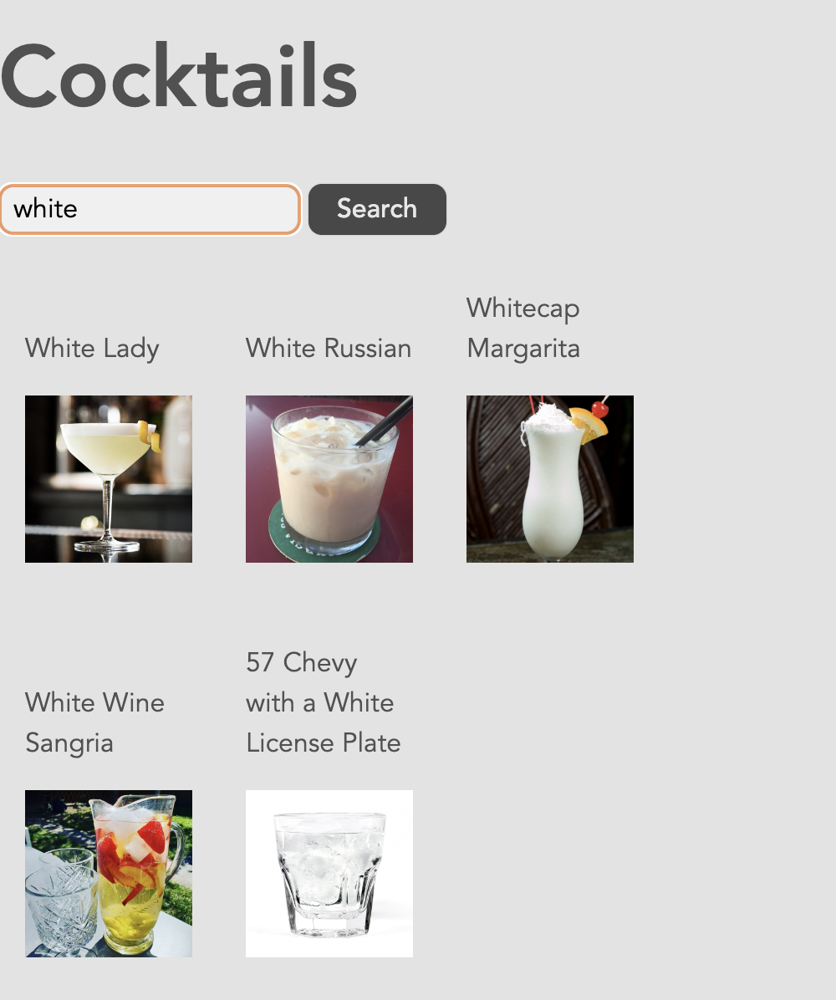
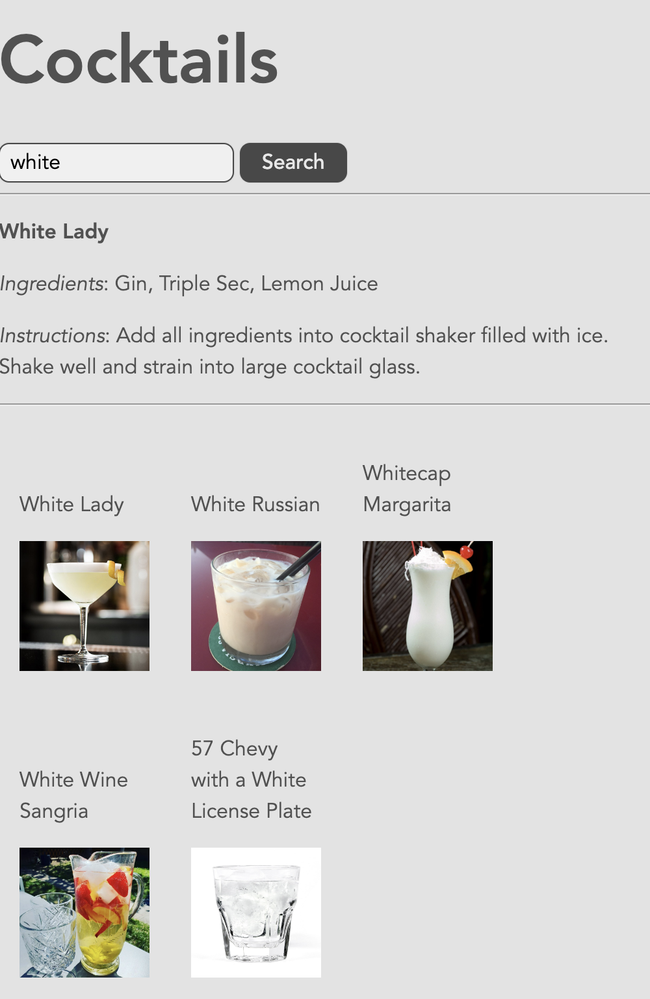

2-cocktails
===

Faire un nouveau dossier `2-cocktails` à la racine de votre dépôt avec `vite` :
```
cd w51
npm create vite@latest 2-cocktails -- --template react
# ou la ligne suivante avec npm 6.x
npm create vite@latest 2-cocktails --template react
```

Comme pour le sujet 1, écraser le fichier `src/index.css` par celui fourni dans le dossier `ressources`, supprimer le fichier `src/App.css` et nettoyer le composant `App` dans le fichier `src/App.jsx`.
Pour ce sujet, vous pouvez rajouter le contenu suivant au fichier CSS :
```css
.cocktails {
    display: flex;
    flex-direction: row;
    align-items: end;
    flex-wrap: wrap;
}

.cocktails div {
    margin: 1rem;
    max-width: 100px;
    flex: 1 1 auto;
    display: flex;
    flex-direction: column;
    cursor: pointer;
}

.cocktails div img {
    width: 100%;
}
```

---

Récupérer des données auprès d'une API
===

On va développer une application qui permet de naviguer parmi les données exposées par l'API `https://www.thecocktaildb.com/`.

Mettre en place une interface avec un formulaire contenant un `input` et un bouton :


À la soumission du formulaire (`onSubmit`), une fonction est appelée avec un objet `event` en paramètre. Cette fonction a plusieurs objectifs :
- empêcher le navigateur d'effectuer son comportement standard (à savoir faire une requête à l'URL indiquée dans la propriété `action` avec la méthode indiquée dans la propriété `method` du formulaire, puis recharger une nouvelle page avec la réponse).
- récupérer le contenu de l'input (`event.target` est ici le formulaire; on peut accéder aux éléments qui le composent en écrivant par exemple `event.target['bidule']` où `bidule` est la valeur donnée à la propriété `name` d'un élément du formulaire; `event.target['bidule'].value` est la valeur de cet élément).
- effectuer une requête HTTP à l'URL `https://www.thecocktaildb.com/api/json/v1/1/search.php?s=[SEARCH]` où `[SEARCH]` est le contenu de l'input.

La fonction standard `fetch` permet de déclencher une requête HTTP. Elle retourne une `Promise` qui est résolue au moment de l'arrivée d'une réponse. Exemple d'utilisation :

```js
fetch(someURL)
.then(response => {
	return response.json(); // pour parser le corps de la réponse au format JSON (retourne une nouvelle Promise)
})
.then(data => {
    // faire quelque chose avec les données
	console.log('data : ', data)
});
```

> Essayer de faire des requêtes auprès de l'API en utilisant par exemple le navigateur (en collant l'URL dans la barre d'adresse) et regarder le contenu de la réponse dans différents cas (vous pouvez mettre la chaîne JSON en forme avec un outil en ligne comme par exemple https://jsonformatter.curiousconcept.com/).

> **Attention** : en cas d'absence de données correspondant à la recherche, l'API renvoie bien une réponse avec un contenu au format JSON, mais le champ `drinks` n'est pas un tableau vide (comme on aurait pu s'y attendre) mais la valeur `null`.

- une fois la réponse obtenue, parser le texte de la réponse qui est au format JSON.
- stocker les données pertinentes dans le `state` du composant (vous pouvez regarder le contenu de la réponse dans la console ou en faisant une requête avec le navigateur et en collant le texte obtenu dans un viewer de JSON en ligne).

Une fois les données dans le `state`, faire en sorte que le composant les affiche en-dessous du formulaire de recherche, au sein d'une `div` avec la `class` CSS "`cocktails`". Pour chaque cocktail obtenu, cette `div` contiendra une autre `div` contenant :
- un paragraphe avec le nom du cocktail.
- une image miniature.

> **Attention** : comme le mot `class` est réservé en JS, on utilise ici la propriété `className` pour spécifier la valeur de cette propriété.

Les données que l'on a en `state` sont de la forme :
```js
[
    {
        idDrink: "17194",
        strDrink: "White Lady",
        strDrinkThumb: "...",
        ...
    }, {
        idDrink: "12528",
        strDrink: "White Russian",
        strDrinkThumb: "...",
        ...

    }
]
```
À partir de ces données, on veut générer la hiérarchie d'éléments React suivante :
```html
<div className="cocktails">
    <div>
        <p>...</p>
        
    </div>
    <div>
        <p>...</p>
        
    </div>
    ...
</div>
```

En JSX, les éléments `children` d'un autre élément peuvent être donnés sous la forme d'un tableau d'éléments.
Les déclarations suivantes sont toutes équivalentes :
```js
return <div>
    <div>...</div>
    <div>...</div>
</div>;
/********************/
let tab = [
    <div>...</div>,
    <div>...</div>,
];
return <div>{tab}</div>;
/********************/
return <div>{[
    <div>...</div>,
    <div>...</div>,
]}</div>;
```
Le fait d'utiliser un tableau (les 2 dernières versions) quand on connait le nombre d'éléments *a priori* n'a aucun intérêt. En revanche, quand le nombre d'éléments est variable, c'est la seule approche possible.

Dans notre cas, à partir du tableau d'objets contenant chacun les données d'un cocktail, on veut générer un tableau d'éléments `div` contenant chacun un paragraphe et une image. La fonction standard `map` appelée sur un tableau permet de générer un nouveau tableau de même taille. Pour chaque case du tableau initial, la fonction fournie lors de l'appel à `map` est appelée avec le contenu de la case en paramètre, et c'est la valeur retournée qui sera stockée dans la case correspondante du nouveau tableau généré.

Si notre tableau s'appelle `cocktails`, on peut donc écrire :
```js
return <div>
    {cocktails.map((c) => <div key={c.idDrink}>
        <p>{c.strDrink}</p>
        
    </div>)}
</div>;
```

La propriété `key` est primordiale ici pour que React puisse distinguer des éléments de même type au même endroit de l'arborescence entre deux passes de rendu successives. On utilise ici l'identifiant du cocktail qui est stable et unique.

Faire en sorte d'obtenir un résultat similaire à l'image suivante :



Au clic sur l'un des cocktails affichés, on souhaite maintenant afficher, entre le formulaire et les réponses, la liste des ingrédients ainsi que les instructions de préparation. Une nouvelle entrée de `state` permettra de stocker le cocktail sélectionné. On peut initialiser cette entrée à la valeur `null`.

Faire en sorte qu'une fonction soit appelée lors du clic sur un cocktail affiché. Dans cette fonction, stocker le cocktail correspondant dans le `state`. Si cette entrée de `state` contient une valeur non-`null`, alors les détails souhaités seront affichés lors de l'évaluation de l'interface. Vous pouvez isoler la gestion de cet affichage dans un composant qui reçoit en `props` l'objet cocktail à afficher.

Vous devriez obtenir un résultat similaire à l'image suivante :


