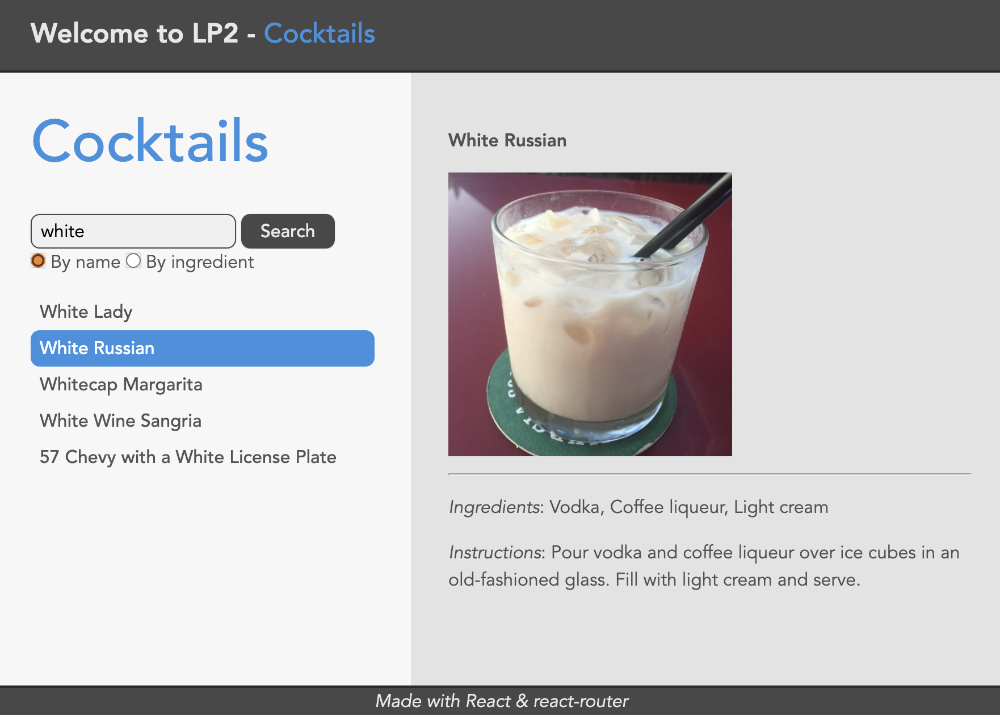

3-cocktails_routed
===

Faire un nouveau dossier `3-cocktails_routed` à la racine de votre dépôt avec `vite` :
```
cd w51
npm create vite@latest 3-cocktails_routed -- --template react
# ou la ligne suivante avec npm 6.x
npm create vite@latest 3-cocktails_routed --template react
```

Comme pour les sujets précédents, écraser le fichier `src/index.css` par celui fourni dans le dossier `ressources`.
Supprimer les fichiers `src/App.css` et `src/App.jsx`.

Jusqu'à présent, l'interface de nos applications est plus ou moins dynamique, mais à chaque chargement, cette dernière revient dans son état initial.
Rien ne permet d'exprimer ou de matérialiser l'état courant de l'interface et on ne peut donc pas non plus le restaurer.

C'est notamment ce problème que la bibliothèque `React Router` (https://reactrouter.com/en/main) résout.
Installer cette bibliothèque dans votre projet en exécutant la commande suivante :
```
npm install react-router-dom
```

Depuis le dossier `ressources`, copier le fichier `error.jsx` dans le dossier `src` et le fichier `root.jsx` dans un nouveau dossier `src/routes`.
Récupérer également le fichier `vite.config.js` et écraser celui présent à la racine de votre projet.

> La modification apportée à la config de `vite` permet de faire des imports de modules locaux depuis n'importe quel endroit de votre arborescence de fichiers. Le chemin est exprimé de manière absolue à partir de votre dossier `src` en démarrant par le caractère `@`. Exemple : `import '@/routes/root'`.

---

Première mise en place
===

Remplacer le contenu du fichier `src/main.jsx` par le code qui suit.

Il y a beaucoup de choses à commenter et à expliquer ici !
Tellement que je ne vais pas le faire ici, mais qu'on va le faire en live pendant la séance (la lecture de la doc sur le site de `React Router` peut vous apporter beaucoup aussi).

L'idée ici est de jouer avec les routes soit en cliquant sur des liens, soit en tapant directement dans la barre d'adresse du navigateur, de voir ce qu'il se passe et de comprendre comment les choses fonctionnent, notamment :
- l'imbrication de routes
- `<Link>`
- `<Outlet />`
- les segments dynamiques
- la gestion d'erreurs

```js
import React from 'react';
import ReactDOM from 'react-dom/client';
import {
  createBrowserRouter,
  RouterProvider,
  Outlet,
  useParams,
  Link,
  Navigate
} from 'react-router-dom';

import '@/index.css';

import Root from '@/routes/root';
import Error from '@/error';

const router = createBrowserRouter([
  {
    path: '/',
    element: <Root />,
    children: [
      {
        path: 'cocktails',
        element: <div>
          <p>Cocktails!</p>
          <Link to="/hello">Hello</Link>
        </div>
      },
      {
        path: 'hello',
        element: <div>
            Hello <Outlet /> !
        </div>,
        errorElement: <Error />,
        children: [
          {
            index: true,
            element: <span>nobody</span>
          },
          {
            path: 'world',
            element: <span>World</span>
          },
          {
            path: ':name',
            element: <Name />,
          }
        ]
      }
    ]
  },
  {
    path: '*',
    element: <Navigate to="/" />
  }
], {
  future: {
    v7_normalizeFormMethod: true,
  },
});

function Name() {
  let { name } = useParams();
  if (name === 'pierre') {
    throw { message: 'Je ne vous permets pas!' };
  }
  return <span> dear {name}</span>;
}

ReactDOM.createRoot(document.getElementById('root')).render(
  <React.StrictMode>
    <RouterProvider router={router} />
  </React.StrictMode>
);
```

> ***Remarque*** : l'option `v7_normalizeFormMethod: true` permet de faire en sorte que `React Router` utilise les noms de méthodes HTTP en majuscule dans ses objets internes, conformément au standard. À retenir : on écrira toujours les noms de méthodes HTTP en majuscule (`GET`, `POST`, `DELETE`, etc.).

---

Cocktails routés
===

Maintenant qu'on a les bases, on va pouvoir mettre en place progressivement une version routée de l'application de navigation de recettes de cocktails.

Première route
---

- mettre en place une route `/cocktails` et y associer un élément d'un nouveau composant `Cocktails`. Ce composant doit être exporté par un nouveau module `src/routes/cocktails.jsx`. Le layout général de ce composant sera le suivant :

```js
<>
  <div id="sidebar">
    <Form>
      ... // un input (name="search") + un bouton
    </Form>
    <nav>
      <ul>
        <li> Nom du cocktail sous la forme d'un lien </li>
        ...
      </ul>
    </nav>
  </div>
  <div id="detail">
    <Outlet /> // -> la sous-route (détail du cocktail courant) sera rendue ici
  </div>
</>
```

- compléter le `Form` avec les éléments nécessaires.
- laisser la liste de noms de cocktails vide pour le moment (on va voir dans la suite où et comment récupérer ces données).

Chose importante à noter ici, on utilise le composant `Form` fourni par `React Router` et non un élément standard `form` (https://reactrouter.com/en/main/components/form).
La propriété `name` de tous les champs du formulaire doit bien avoir été définie car c'est sous ce nom que l'on pourra retrouver les données par la suite.

Lors de la soumission d'un `Form`, ce n'est pas le comportement standard du navigateur qui est exécuté.
`React Router` crée bien un objet standard `Request`, mais ce dernier ne quitte pas le client : il est "envoyé" à la route "client" indiquée dans la propriété `action` (par défaut, la route matchée par le composant courant) avec la méthode indiquée dans la propriété `method` (par défaut, GET).
Dans le cas d'une requête GET, la soumission du formulaire revient en fait à cliquer sur un `<Link>` en sérialisant au passage les champs du formulaire dans la query string du formulaire.
Dans le cas d'une requête POST, DELETE, PUT ou PATCH, c'est différent, et on verra ça dans le prochain sujet.

Premier loader
---

Lors de la navigation vers une route, les `loader` (https://reactrouter.com/en/main/route/loader) des routes et sous-routes matchées sont appelés en parallèle (les conditions d'appel des `loader` sont plus subtiles, mais on détaillera cela si vous le souhaitez). Si ces fonctions renvoient des `Promise`, la résolution de ces dernières est attendue, la navigation est dans un état `loading`, et l'interface courante reste à l'écran.

Les `loader` sont appelés avec un objet en paramètre, dont on peut extraire notamment les `params` (valeurs des segments dynamiques de la route) et la `request` (l'objet `Request`). Comme indiqué dans la documentation, il est classique de récupérer le contenu de la query string en faisant appel à l'objet standard `URL`.

Une fois les données des `loader` arrivées, la navigation est effectuée et l'interface correspondant à la nouvelle route est évaluée. Les composants ont accès aux données de leur `loader` grâce au hook `useLoaderData` (https://reactrouter.com/en/main/hooks/use-loader-data).

- déclarer un `loader` associé à la route `cocktails`. Cette fonction doit également être exportée par le module `src/routes/cocktails.jsx`. Dans cette fonction, on récupère d'abord la valeur du champ "`search`" de la query string, puis on retourne une `Promise` qui se résout en la liste de cocktails. S'il n'y a pas de champ "`search`" dans la query string ou que ce dernier est vide, on peut renvoyer directement des données vides.
- récupérer les données du `loader` dans le composant `Cocktails` et afficher la liste des cocktails dans la liste du `<nav>` s'il y en a, et un texte qui indique l'absence de résultats sinon.

Synchroniser la route et l'interface
---

Vous pouvez constater que lorsqu'on recharge la page, bien que le contenu de la query string soit toujours là et que le `loader` charge bien les données correspondantes, l'`<input>` du formulaire est vidé. De même, si vous réalisez des recherches successives puis naviguez en arrière dans l'historique, le `loader` chargera bien les données, mais le contenu de l'`<input>` restera dans son dernier état. L'interface n'est pas synchronisée avec l'état de la route.

- dans le `loader`, en plus de la liste des cocktails, retourner la chaîne de recherche issue de la query string.
- dans le composant `Cocktails`, on peut donc maintenant aussi récupérer cette valeur avec `useLoaderData`. Si on ajoute l'effect suivant, on synchronise le contenu de l'`<input>` avec la valeur issue de la query string :
```js
let { search } = useLoaderData(); // le loader nous met à disposition ce champ issu de la query string
useEffect(() => { document.getElementById('[ID_INPUT]').value = search}, [search]);
```
- s'assurer que tout fonctionne comme prévu.

Sous-routes dynamiques
---

- mettre en place la sous-route `index` de la route `cocktails` afin d'afficher quelque chose dans l'`Outlet` même quand aucun cocktail n'est sélectionné (c'est-à-dire quand la route courante est exactement `/cocktails`).
- mettre en place la sous-route dynamique `:cocktailId` de la route `cocktails` et y associer un élément d'un nouveau composant `Cocktail`. Ce composant doit être exporté par un nouveau module `src/routes/cocktail.jsx`.
- déclarer un `loader` associé à la sous-route `:cocktailId`. Cette fonction doit également être exportée par le module `src/routes/cocktail.jsx`.

Pour ce `loader`, on pourra faire appel à un autre endpoint de l'API : `https://www.thecocktaildb.com/api/json/v1/1/lookup.php?i=[COCKTAIL_ID]`, où `[COCKTAIL_ID]` est l'identifiant du cocktail.

- récupérer les données du `loader` et les afficher dans le composant `Cocktail`.

Vous devriez constater que quand vous naviguez de la route `/cocktails?search=blue` vers la route `/cocktails/1234`, le formulaire de recherche et la liste de résultats se vident. Puisqu'on a fait en sorte de synchroniser l'interface avec la route, c'est normal. Mais ce n'est pas ce que l'on veut !

Afin de conserver la partie query string au moment du clic sur un `<Link>`, on peut utiliser le composant `<LinkWithQuery>` que je vous fournis dans le module `linkWithQuery.jsx` du dossier `ressources`. Ainsi, la partie query string est préservée lors de la navigation. Regardez bien comment ce petit composant est écrit.

Ajouter un délai artificiel
---

Afin de mieux voir les états intermédiaires de l'interface pendant les phases de chargement et d'attente de données, on peut se doter d'une petite fonction utilitaire que l'on peut appeler au moment de déclencher des requêtes. La fonction suivante retourne une nouvelle Promise qui se résout (sans fournir de données) au bout d'un temps aléatoire compris en 0 et `max` millisecondes.

```js
function delay(max) {
  return new Promise(resolve => {
    setTimeout(resolve, Math.random() * max);
  });
}
```

Vous pouvez exporter cette fonction depuis un module, puis l'importer et l'utiliser par exemple dans un `loader` de la façon suivante :
```js
return delay(1000)
  .then(() => fetch(URL))
  ...
```

Si vous voulez un délai constant, vous pouvez aussi bien enlever la partie aléatoire de la fonction.

Amélioration de l'UX
---

- faire en sorte que le lien dans la sidebar du cocktail correspondant à la route courante ait la classe CSS `active` et que celui en cours de navigation (vers lequel on navigue et dont on attend la fin de la phase `loading`) ait la classe `pending` (https://reactrouter.com/en/main/start/overview#active-links).
- dans le composant `Cocktails`, faire en sorte que le bouton de recherche soit désactivé et affiche le texte "Searching" (au lieu de "Search") pendant la phase de `loading` (https://reactrouter.com/en/main/hooks/use-navigation).

Pour savoir si on est bien en attente d'une recherche, on va combiner le fait que le `state` de l'objet `navigation` renvoyé par l'appel à `useNavigation()` soit égal à `loading`, et le fait que la destination de cette navigation (`navigation.location.pathname`) soit bien égale à `/cocktails`.

Pour désactiver un bouton, on utilise la propriété `disabled` dont on définit la valeur à `"disabled"` si on veut désactiver l'élément ou à une chaîne vide si on souhaite le garder actif.

- faire en sorte qu'au cours de la phase `loading`, toute la partie contenant les détails sur le cocktail courant soit "grisée".

Pour cela, on va à nouveau se baser sur le `state` de l'objet retourné par `useNvigation()`. On peut ensuite définir dynamiquement la valeur de la propriété CSS `opacity` (par exemple `0.5` en cours de chargement et `1` le reste du temps). On peut aussi passer par une classe CSS et faire des modifications en conséquence dans le fichier `index.css`.

Recherche par ingrédient
---

L'API "The Cocktail DB" permet également de faire une recherche par ingrédient à l'URL `https://www.thecocktaildb.com/api/json/v1/1/filter.php?i=[SEARCH]` où `[SEARCH]` est le nom de l'ingrédient.

> **Attention** : en cas d'absence de résultat, l'API ne renvoie pas un contenu avec le `Content-Type: application/json`, mais un body vide avec le `Content-Type: text/html`. Il faut donc traiter ce cas (par exemple, on peut faire quelque chose comme `if (res.headers.get('Content-Type').startsWith('application/json'))`).

- ajouter des boutons radio dans le formulaire de recherche pour permettre à l'utilisateur de choisir s'il souhaite faire une recherche par nom ou par ingrédient.
- la valeur du bouton radio sélectionné s'ajoute donc dans la query string : gérer cette valeur comme celle du champ de recherche (prise en compte dans le `loader` + synchronisation de l'interface).

Voici un exemple de ce à quoi peut ressembler l'interface :


