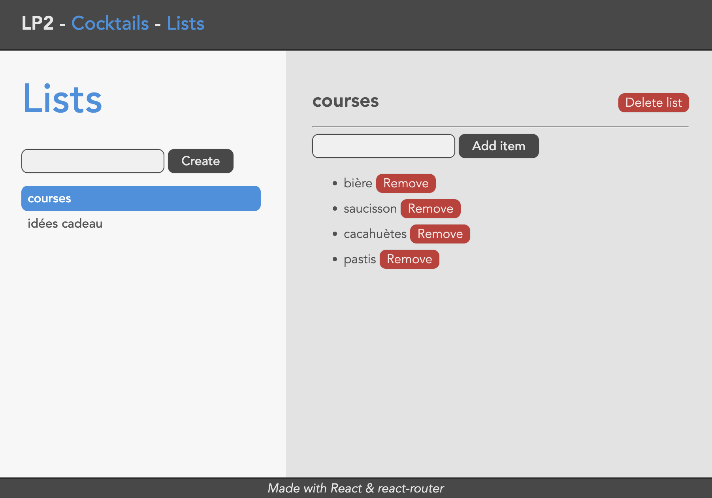

4-lists
===

Faire un nouveau dossier `4-lists` à la racine de votre dépôt avec `vite` :
```
cd w51
npm create vite@latest 4-lists -- --template react
# ou la ligne suivante avec npm 6.x
npm create vite@latest 4-lists --template react
```

Comme pour les sujets précédents, écraser le fichier `src/index.css` par celui fourni dans le dossier `ressources`, et supprimer le fichier `src/App.css`.

Récupérer les fichiers `src/main.jsx`, `src/error.jsx`, `src/linkWithQuery.jsx` ainsi que tout le dossier `routes` (qui contient normalement les fichiers `root.jsx`, `cocktails.jsx` et `cocktail.jsx`).
Récupérer également le fichier `vite.config.js` et écraser celui présent à la racine de votre projet.

---

On va étendre l'application précédente en ajoutant une interface qui permet de gérer des listes d'items, en lien avec une API HTTP.

- récupérer l'archive `4_lists_server.zip` dans le dossier `ressources`.
- une fois décompréssée, installer les dépendances en exécutant `npm install`, puis lancer le serveur avec `npm run start`.
- regarder les routes disponibles dans les fichiers `routes/list.js` et `routes/item.js`.

Nouvelles routes
---

- ajouter un `Link` menant vers la route `/lists` dans l'en-tête décrite dans le fichier `src/routes/root.jsx`.
- mettre en place une route `/lists` et y associer un élément d'un nouveau composant `Lists`. Ce composant doit être exporté par un nouveau module `src/routes/lists.jsx`. Le layout général de ce composant sera le suivant :

```js
<>
  <div id="sidebar">
    <Form>
      ... // un input (name="title") + un bouton
    </Form>
    <nav>
      <ul>
        <li> Titre de la liste sous la forme d'un lien </li>
        ...
      </ul>
    </nav>
  </div>
  <div id="detail">
    <Outlet /> // -> la sous-route (détail de la liste courante) sera rendue ici
  </div>
</>
```

Comme précédemment, un `loader` associé à la route `/lists` est chargé de récupérer les listes auprès de l'API (route `GET /lists`) afin qu'elles soient accessibles au composant `Lists`. Ce `loader` ne dépend pas ici d'une requête issue du formulaire. Il récupère simplement l'ensemble des listes disponibles.

- déclarer un `loader` associé à la route `lists`. Cette fonction doit également être exportée par le module `src/routes/lists.jsx`.
- récupérer les données du `loader` dans le composant `Lists` et afficher la liste des listes (!) dans la liste (!!) du `<nav>` s'il y en a, et un texte qui indique l'absence de résultats sinon.

Requêtes `POST`
---

On va ici se servir du formulaire pour créer de nouvelles listes. Notre formulaire va générer des requêtes `POST` à destination de la route client `/lists`. Pour cela, on va indiquer la valeur `POST` dans la propriété `method` du composant `Form`.

Lors de la soumission du formulaire, `React Router` crée un objet standard `Request`, mais ce dernier ne quitte pas le client : il est "envoyé" à la route indiquée dans la propriété `action` (par défaut, la route matchée par le composant courant, donc `/lists` dans notre cas) avec la méthode indiquée dans la propriété `method` (https://reactrouter.com/en/main/route/action).

- déclarer une `action` associée à la route `/lists`. Cette fonction doit également être exportée par le module `src/routes/lists.jsx`.

Dans le cas d'une requête `POST`, la fonction déclarée dans la propriété `action` de la configuration de la route cible est appelée avec un objet en paramètre. On peut extraire les `params` (valeurs des segments dynamiques de la route) et la `request` (l'objet `Request`) de cet objet.

À ce moment là, la navigation (https://reactrouter.com/en/main/hooks/use-navigation) passe dans l'état `submitting` mais la route courante n'est pas encore modifiée. Comme pour les `loader`, quand une `action` renvoie une `Promise`, la résolution de cette dernière est attendue. Quand la `Promise` est résolue, la navigation passe dans l'état `loading`, avec la route cible comme route courante. Selon les cas, une redirection peut également être déclenchée dans l'`action` en retournant un appel à la fonction `redirect` fournie par `React Router` (https://reactrouter.com/en/main/fetch/redirect). Dans tous les cas (que la route courante ait changé ou non), après une phase  de `submitting`, les `loader` sont à nouveau invoqués, permettant ainsi de rafraichir les données.

- dans l'`action` de la route `/lists`, récupérer le contenu des données du formulaire grâce à la fonction `formData()` de l'objet `request`. Cette fonction renvoie une `Promise` qui est résolue en un objet standard `FormData`. Une fois cet objet obtenu, on peut créer un objet JS "classique" en appelant `let data = Object.fromEntries(formData)`. Faire ensuite une requête `POST` à l'API à la route `/lists` avec les données dans le `body` et un header `Content-Type` égal à `application/json`.

Comme les `loader` sont appelés après une soumission, les nouvelles listes créées doivent normalement s'afficher dans l'interface.

Sous-routes dynamiques
---

- mettre en place la sous-route `index` de la route `lists` afin d'afficher quelque chose dans l'`Outlet` même quand aucune liste n'est sélectionnée (c'est-à-dire quand la route courante est exactement `/lists`).
- mettre en place la sous-route dynamique `:listId` de la route `lists` et y associer un élément d'un nouveau composant `List`. Ce composant doit être exporté par un nouveau module `src/routes/list.jsx`.
- déclarer un `loader` associé à la sous-route `:listId`. Cette fonction doit également être exportée par le module `src/routes/list.jsx`.

Dans ce `loader`, on fera appel à deux endpoints de l'API, qu'on attendra conjointement grâce à la fonction `Promise.all` : `GET /lists/[LIST_ID]` (où `[LIST_ID]` est l'identifiant de la liste) qui retourne les propriétés de la liste (notamment son `title`), et `GET /lists/[LIST_ID]/items` (où `[LIST_ID]` est l'identifiant de la liste) qui retourne l'ensemble des items de la liste.

- récupérer les données du `loader` et les afficher dans le composant `List` (titre de la liste + items).
- dans l'`action` de création d'une nouvelle liste, après l'ajout, rediriger l'interface vers la route `/lists/[LIST_ID]` où `[LIST_ID]` est l'identifiant de la liste qui vient d'être créée (l'API retourne l'objet créé, dans lequel on peut trouver son identifiant).

On va ajouter tout de suite la logique de suppression d'une liste. Du côté de l'API, on a la route `DELETE /lists/[LIST_ID]` à disposition.

- à côté du titre de la liste, ajouter un nouveau `Form` dont la `method` est `DELETE` et l'`action` garde sa valeur par défaut (qui sera donc égale à `/lists/[LIST_ID]`). Afin que ce formulaire ne déclenche pas de retour à la ligne, on peut ajouter `style={{ float: 'right', display: "inline" }}`.
- déclarer un bouton dans ce formulaire. Aucun autre élément n'est utile puisque toute l'information nécessaire est déjà contenue dans la méthode HTTP et son action.
- déclarer une `action` associée à la route `/lists/:listId`. Cette fonction doit également être exportée par le module `src/routes/list.jsx`.
- dans cette `action`, faire une requête à l'API à la route `DELETE /lists/[LIST_ID]`. L'identifiant de la liste peut être récupéré dans les `params` qui sont passés à l'`action`. Comme la liste est supprimée, on ne souhaite pas laisser l'application à la route courante : après le retour de l'API, rediriger (`redirect`) l'interface vers la route `/lists`.

Fetchers
---

Il arrive régulièrement que l'on souhaite déclencher des requêtes auprès d'une API, mais sans forcément que cela n'implique une action de *navigation* au niveau de l'interface et des routes client.

Avec `React Router`, la manière standard de déclencher des requêtes est d'utiliser le composant `Form`. Cependant, ce dernier initie toujours une *navigation* lors de la soumission. Afin d'éviter ce comportement, `React Router` propose la notion de `Fetcher` (https://reactrouter.com/en/main/hooks/use-fetcher).

- déclarer un `fetcher` dans le composant `List` (`useFetcher`).
- déclarer un `fetcher.Form` au-dessus de la liste des items de la liste afin de pouvoir ajouter un nouvel item (un input text + un bouton). La `method` de ce formulaire est `POST` et l'`action` est `items` (chemin relatif).

À la soumission de ce formulaire, `React Router` va créer un objet `Request` et le transmettre à l'`action` déclarée sur la route `/lists/:listId/items`, mais sans déclencher de *navigation*.

- mettre en place la sous-route `items` de la route `/lists/:listId/`.
- déclarer une `action` associée à cette route. Cette fonction doit être exportée par un nouveau module `src/routes/listItems.jsx`.
- dans cette `action`, récupérer le contenu des données du formulaire puis faire une requête à l'API à la route `POST /lists/[LIST_ID]/items` avec les données dans le `body` et un header `Content-Type` égal à `application/json`. L'identifiant de la liste peut être récupéré dans les `params` qui sont passés à l'`action`.

Même sans *navigation*, les `loader` sont appelés après une soumission de formulaire, et les nouveaux items créés doivent normalement s'afficher dans l'interface.

Afin de permettre la suppression des différents items de la liste, on va ajouter un bouton "Remove" à côté de chaque item. Afin de pouvoir gérer l'état de ces requêtes de suppression de manière individuelle (plusieurs peuvent avoir lieu en parallèle), il faut un `fetcher` pour chaque item. Le plus simple est alors d'écire un composant `ListItem`, qui reçoit un `item` en entrée. Ce composant se charge de l'affichage et encapsule un `fetcher` pour gérer la requête de suppression de l'item.

Pour exploiter le même mécanisme qu'auparavant, le bouton de suppression sera en fait le seul élément d'un `fetcher.Form`, avec la même `action` que pour l'ajout d'un item (`items`, en chemin relatif), mais cette fois-ci avec la `method` `DELETE`.

Afin de passer l'information de l'identifiant de l'item dont on demande la suppression, on peut définir des propriétés `name` et `value` sur le `button` directement (pas besoin d'ajouter un `input` caché contenant cette information).

- écrire le composant `ListItem`.
- mettre en place le fomulaire de suppression (ajouter `style={{ display: "inline" }}` à la déclaration du formulaire pour éviter un retour à la ligne).
- comme l'`action` est le même que pour le formulaire d'ajout, il va falloir distinguer les cas au sein de cette fonction. On peut faire cela en fonction de la valeur de la propriété `request.method`. Pour demander la suppresion d'un item auprès de l'API, il faut faire un requête à la route `DELETE /items/[ITEM_ID]`, où `[ITEM_ID]` est l'identifiant de l'item à supprimer.

Amélioration de l'UX
---

Tout comme pour le sujet précédent, il est important de prendre en compte le fait que les requêtes peuvent mettre du temps à être traitées par l'API. On peut mettre en place différents indices visuels pour donner à l'utilisateur un retour sur l'état courant de l'application et éviter de mauvaises manipulations.

Comme on maîtrise ici l'API, le plus simple pour générer du délai dans les réponses reste d'ajouter ce petit bout de code dans le fichier `server.js`, juste avant l'enregistrement des routes (et de ne plus utiliser la fonction `delay`) :
```js
app.use((req, res, next) => {
	setTimeout(next, Math.random() * 2000); // délai aléatoire entre 0 et 2 secondes
  // pour tester différents cas, vous pouvez modifier le délai ou enlever le côté aléatoire
});
```

- faire en sorte que le lien dans la sidebar de la liste correspondant à la route courante ait la classe CSS `active` et que celui en cours de navigation (vers lequel on navigue et dont on attend la fin de la phase `loading`) ait la classe `pending` (https://reactrouter.com/en/main/start/overview#active-links).

*Pendant* l'ajout d'une liste, le texte du bouton de soumission peut être modifié et ce dernier désactivé. *Après* l'ajout d'une liste il est plus agréable que le contenu de l'input soit vidé. On peut réaliser cela en exploitant les informations fournies par `useNavigation` (https://reactrouter.com/en/main/hooks/use-navigation).

> ***Indication*** : pour bien comprendre ce qu'il se passe, je vous invite à afficher dans la console les valeurs des différentes propriétés de l'objet `navigation` retourné par `useNavigation`.

- dans le composant `Lists`, si `formAction` est égal à `/lists` (on se restreint aux navigations déclenchées par ce formulaire) et que `formMethod` est égal à `POST` (ce qui est le cas pendant les phases `submitting` et `loading` qui suivent la soumission du formulaire), alors c'est que la soumission du formulaire d'ajout d'une liste est en cours. Dans ce cas, modifier le texte du bouton et le désactiver.
- dans le composant `Lists` si `formAction` est égal à `/lists` et que `state` est égal à `loading`, c'est que la soumission a réussi et que `React Router` est en train de revalider les `loader`. Dans ce cas, on peut vider le contenu de l'input du formulaire (en se servant de son `id` et de la fonction standard `getElementById` par exemple).

On peut également modifier le texte et désactiver le bouton de suppression d'une liste dans le composant `List`, en employant la même méthode.

Au passage, on peut aussi demander à l'utilisateur une confirmation avant de lancer la suppression d'une liste. Le plus simple consiste à utiliser la fonction standard `confirm` (https://developer.mozilla.org/en-US/docs/Web/API/Window/confirm) dans le `onSubmit` du formulaire de suppression, et d'appeler la fonction standard `preventDefault` sur l'objet `event` reçu en paramètre de ce `onSubmit` si la réponse est négative.

Pour appliquer le même traitement aux formulaires d'ajout et de suppression d'un item à une liste, il y a une petite différence : on utilise ici un `Fetcher` et il n'y a donc pas de *navigation* liée à la soumission du formulaire. Cependant, l'objet `fetcher` dispose aussi de propriétés `state`, `formAction` et `formMethod`. Une petite simplification peut être effectuée ici : comme les `fetchers` sont exclusifs aux formulaires en question (contrairement à la *navigation* qui est globale), il n'est pas nécessaire de tester la valeur de `formAction`.

- modifier le texte et l'activation des boutons en fonction de l'état des formulaires (ajout/suppression d'un élément).
- vider le texte de l'input d'ajout après un ajout.

Voici un exemple de ce à quoi peut ressembler l'interface :



- s'assurer que tout fonctionne comme attendu.

Optimistic UI
---

Dans l'état actuel, on indique bien à l'utilisateur les états d'attente, et comme les `loader` sont appelés après chaque soumission de formulaire, les données à jour sont bien affichées dans l'interface. Cependant, le temps de latence entre la soumission du formulaire et le rafraichissement des données pourrait être comblé en remplissant l'interface de manière **optimiste** avec les données soumises.

Par exemple, dans le cas de l'ajout d'une nouvelle liste, pendant la soumission du formulaire, l'objet `navigation` dispose d'une propriété `formData` qui contient les données du formulaire (cette propriété vaut `undefined` le reste du temps).

- dans le composant `Lists`, si `formAction` est égal à `/lists` et qu'il y a des données dans `formData`, rendre un élément `<li>` supplémentaire dans la liste des listes affichées dans la sidebar avec le titre de la liste en cours de soumission (`navigation.formData.get('title')`). On peut styliser cet élément en gris et en italique par exemple pour signifier le côté temporaire de l'information.

Dès que la soumission sera terminée, et que la *navigation* repassera dans l'état `loading`, les `loader` seront à nouveau appelés et les données à jour seront affichées dans l'interface, sans cet élément temporaire puisque la propriété `formData` vaudra à nouveau `undefined`.

- faire de même pour l'ajout d'un item à une liste. La différence ici est que l'on récupère les données du formulaire dans `fetcher.formData` et non dans `navigation.formData`.

Un peu d'organisation de code
---

Dans l'état actuel, on a des appels à `fetch` avec des URL de notre API dans des `loader` et des `action` répartis dans les modules `lists.jsx`, `list.jsx` et `listItems.jsx`.
Cette répartition rend plus difficile à répercuter les éventuelles modifications effectuées au niveau de l'API (routes à appeler, format des données attendues ou retournées, etc.), sans compter le fait d'alourdir le code des `loader` et des `action`.

- créer un nouveau module `api.js`.
- dans ce module, exporter une fonction par route de l'API.

Exemple :
```js
let prefix = 'http://localhost:4200';

export function getLists() {
  return fetch(`${prefix}/lists`)
    .then(res => res.json());
}

export function createList(list) {
  return fetch(`${prefix}/lists`, {
    method: 'POST',
    headers: {
      'Content-Type': 'application/json'
    },
    body: JSON.stringify(list)
  })
    .then((res) => res.json());
}
```

Vous pouvez constater au passage l'utilisation d'une variable `prefix` qui permet de n'avoir qu'une chose à modifier si notre API change de serveur.

Afin de pouvoir utiliser ces fonctions dans nos `loader` et `action`, il suffit d'importer ces fonctions dans les modules concernés.
Le plus simple est probablement de déclarer un import de tous les symboles exportés par le module `api` au sein d'un objet, comme suit :
```js
import * as api from '@/api';

export function loader() {
  return api.getLists()
    .then(lists => ({ lists }));
}
```

- modifier tous les appels à l'API pour faire appel à ces fonctions.
