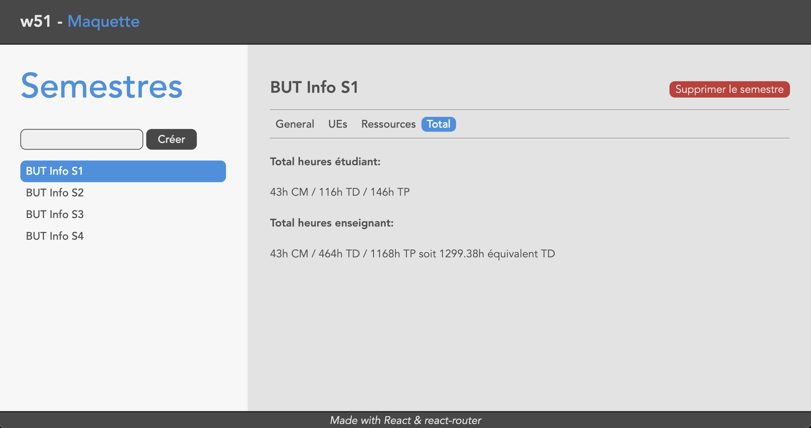

# w51 - TP noté

Vous allez écrire une application web permettant de modéliser l'offre de formation d'un département d'IUT.
Cette application est composée :
 - d'une API HTTP (fournie)
 - d'un client web développé avec les bibliothèques React & React Router (à réaliser)

# Modèle de données

Le modèle de données est le suivant :
- `Semestre` : représente un semestre
  - `intitule` : intitulé du semestre
  - `effectif` : nombre d'étudiants inscrits dans ce semestre
  - `nbGroupesTD` : nombre de groupes de TD
  - `nbGroupesTP` : nombre de groupes de TP
- `UE` : représente une unité d'enseignement
  - `intitule` : intitulé de l'UE
  - `intitule_court` : version courte de l'intitulé de l'UE
- `Ressource` : représente une ressource
  - `nom` : nom de la ressource
  - `hcm` : nombre d'heures de cours magistraux
  - `htd` : nombre d'heures de TD
  - `htp` : nombre d'heures de TP

Les `UE` et les `Ressource` sont associées à un semestre.

# API HTTP

L'API HTTP est fournie dans le dossier `server`. Elle expose les routes suivantes :
 - `GET /semestre` : obtenir l'ensemble des `Semestre`
 - `POST /semestre {intitule, effectif, nbGroupesTD, nbGroupesTP}` : créer un nouveau `Semestre`
 - `GET /semestre/:semestre_id` : obtenir un `Semestre` existant
 - `PUT /semestre/:semestre_id {intitule?, effectif?, nbGroupesTD?, nbGroupesTP?}` : modifier un `Semestre` existant
 - `DELETE /semestre/:semestre_id` : supprimer un `Semestre` existant
---
 - `GET /semestre/:semestre_id/ue` : obtenir l'ensemble des `UE` d'un `Semestre`
 - `POST /semestre/:semestre_id/ue {intitule, intitule_court}` : créer une nouvelle `UE`
 - `GET /semestre/:semestre_id/ue/:ue_id` : obtenir une `UE` existante
 - `PUT /semestre/:semestre_id/ue/:ue_id {intitule?, intitule_court?}` : modifier une `UE` existante
 - `DELETE /semestre/:semestre_id/ue/:ue_id` : supprimer une `UE` existante
---
 - `GET /semestre/:semestre_id/ressource` : obtenir l'ensemble des `Ressource` d'un `Semestre`
 - `POST /semestre/:semestre_id/ressource {nom, hcm, htd, htp}` : créer une nouvelle `Ressource`
 - `GET /semestre/:semestre_id/ressource/:ressource_id` : obtenir une `Ressource` existante
 - `PUT /semestre/:semestre_id/ressource/:ressource_id {nom?, hcm?, htd?, htp?}` : modifier une `Ressource` existante
 - `DELETE /semestre/:semestre_id/ressource/:ressource_id` : supprimer une `Ressource` existante

Cette API utilise un fichier de données `SQLite` local et ne nécessite aucun serveur de base de données.
Pour la démarrer, il suffit d'aller dans le dossier `server`, puis de lancer les commandes :
```sh
npm install
node server.js
```

> Le code de l'API contient une temporisation qui retarde le traitement de toutes les requêtes d'une durée comprise entre 0 et 1 seconde.

# Client web

Le client web est à réaliser dans le dossier `client` existant.
Ce projet a été généré avec `vite`.
Tout ce que vous avez à faire pour lancer l'application est d'aller dans le dossier `client` puis de lancer les commandes :
```sh
npm install
npm run dev
```

> Il y a du code à compléter dans les fichiers suivants (il n'y a aucun fichier à créer) :
> - `src/main.jsx`
> - `src/routes/semestres.jsx`
> - `src/routes/semestre.jsx`
> - `src/routes/general.jsx`
> - `src/routes/ue.jsx`
> - `src/routes/ressource.jsx`
> - `src/routes/total.jsx`

L'application doit proposer des interfaces avec les routes suivantes :

- route `/semestres` :
  - ajout d'un `Semestre`
  - liste des `Semestre` (sous forme de liens)


- route `/semestres/:semestreId` :
  - suppression d'un `Semestre`
  - affichage d'un menu permettant d'accéder aux différentes informations associées à un `Semestre`


- route `/semestres/:semestreId/general` :
  - affichage des informations générales d'un `Semestre`
  - modification des informations générales d'un `Semestre`


- route `/semestres/:semestreId/ue` :
  - ajout d'une `UE`
  - liste des `UE`
  - suppression d'une `UE`


- route `/semestres/:semestreId/ressource` :
  - ajout d'une `Ressource`
  - liste des `Ressource`
  - suppression d'une `Ressource`


- route `/semestres/:semestreId/total` :
  - affichage du total des heures de cours magistraux, de TD et de TP d'un `Semestre` en terme d'heures étudiant et d'heures enseignant

Pour info :
- les heures étudiant sont simplement la somme des heures prévues dans les ressources pour chaque catégorie (CM, TD, TP)
- les heures enseignant sont calculées en multipliant ces valeurs par le nombre de groupes de TD et de TP du semestre
- le total des heures enseignant en "heures équivalent TD" est calculé en multipliant les heures de CM par `1.5` et les heures de TP par `0.66`



# Indications & Rappels

Le fichier `index.css` fourni est similaire à celui utilisé lors des TP. Vous pouvez donc utiliser la même structure de document afin d'obtenir une mise en page similaire.

Le fichier `api.js` exporte un ensemble des fonctions permettant de dialoguer avec l'API (les fonctions sont écrites dans ce fichier dans l'ordre de la description des routes ci-dessus).

Comme vous pouvez le constater dans ces fonctions, quand l'API retourne un ou plusieurs objets, le parsing du JSON est déjà effectué. À la résolution de la `Promise` retournée, vous récupérez donc directement les données.

Par exemple, si vous souhaitez récupérer la liste des semestres existants, ou créer un nouveau semestre, vous pouvez écrire :
```js
import * as api from '@/api';

// quelque part dans un loader
return api.getSemestres()
  .then(semestres => {
    // do something
  });

// quelque part dans une action
return api.createSemestre(semestre)
  .then(semestre => {
    // do something
  });
```

## Requêtes multiples

Afin de déclencher et d'attendre plusieurs requêtes en parallèle, on peut utiliser la fonction `Promise.all`. Cette dernière prend en paramètre un tableau de Promise et retourne une nouvelle Promise. Cette dernière sera résolue avec un tableau dont le contenu de chaque case correspond aux données de résolution de chaque Promise initiale.

Exemple :
```js
return Promise.all([
    fetchSomething(),
    fetchAnotherThing()
])
  .then(([something, anotherThing]) => {
    // do what you want
  });
```

## Fetcher

On utilise des `Fetcher` quand on souhaite gérer un formulaire, mais ne pas déclencher de navigation globale à destination de la route indiquée dans l'`action` lors de sa soumission. Cela est utile notamment quand on veut pouvoir gérer plusieurs soumissions potentiellement parallèles sur une même page.

Dans le cadre de notre application, on va en utiliser pour les formulaires d'ajout d'`UE` et de `Ressource`, ainsi que pour la suppression de chaque `UE` ou `Ressource`.

Tout comme pour l'objet `navigation`, l'état d'un `fetcher` peut être connu en examinant la valeur de sa propriété `state` (qui peut valoir `idle`, `submitting` ou `loading`), ainsi que de ses propriétés `formMethod` et `formData` (dont on peut se servir pour faire de l'optimistic rendering).

## Tableaux

L'interface de gestion des `Ressource` affiche ces dernières sous la forme d'un tableau.

Pour rappel, un tableau HTML est déclaré avec la structure suivante :
```html
<table>
  <thead>
    <tr>
      <th>Colonne 1</th>
      <th>Colonne 2</th>
    </tr>
  </thead>
  <tbody>
    <tr>
      <td>Ligne 1, Colonne 1</td>
      <td>Ligne 1, Colonne 2</td>
    </tr>
    <tr>
      <td>Ligne 2, Colonne 1</td>
      <td>Ligne 2, Colonne 2</td>
    </tr>
  </tbody>
</table>
```

## Gestion des délais de réponse

Comme l'API répond avec une temporisation aléatoire, il vous est demandé de désactiver les boutons des formulaires quand on est en attente d'une réponse, afin de bien indiquer à l'utilisateur que sa demande a été prise en compte.

Le côté fonctionnel de votre application est cependant plus important. Assurez-vous donc que tout fonctionne avant de vous attaquer à cela.
